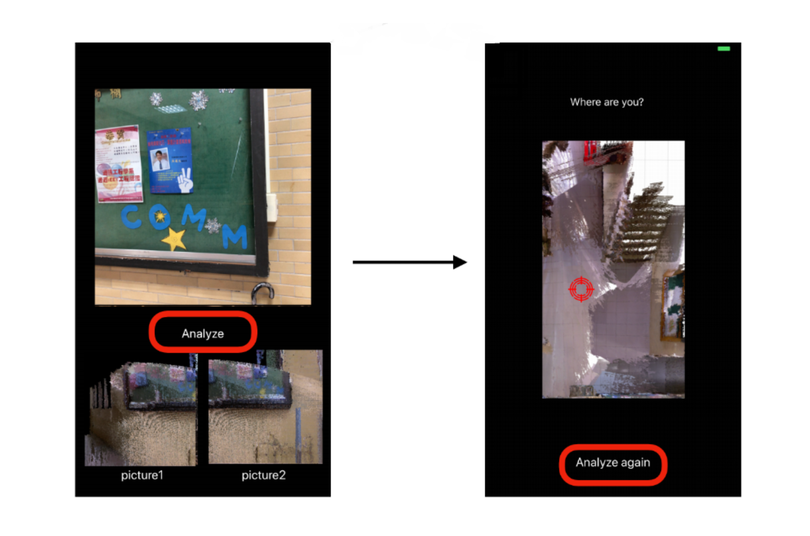
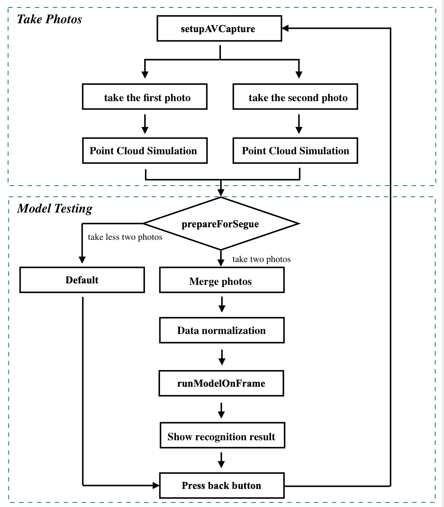
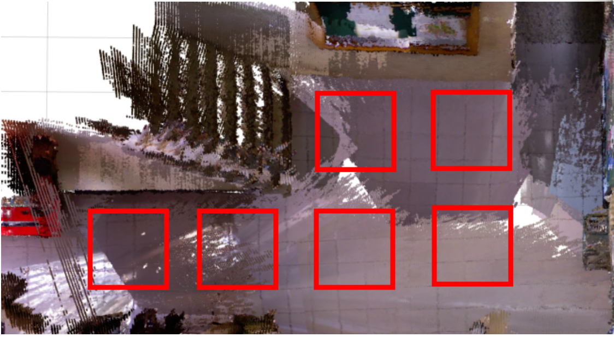

# **CPS (The Camera Position System)**

## Description

CPS (The Camera Position System) combines Convolution Neural Network (CNN) model with IOS camera module to provide users with real-time positioning service. In the beginning, users need to take photos of two continuous viewings in one place. CPS then merges two photos, normalizes data, and inputs the processed photos into the CNN model with TensorFlow Lite interpreter. After gaining the predicting result, CPS will indicate where the user is in the environment.

CPS is the implementation of 3DVPS: A 3D Point Cloud-Based Visual Positioning System. If you want to get more detailed information, please check the [link](https://ieeexplore.ieee.org/abstract/document/9043071).



***

## Environment

+ Xcode version 11.6

***

## Key Point

+ **Photo taking**

  + Implemented photo-taking function with the iPhone camera module to offer the real-time service.

  + Designed two viewing frames providing users to preview the photos. Users could take photos repeatedly until they get satisfying photos to predict the location.

```objc
-(IBAction)takephoto_1:(id)sender{
    AVCaptureConnection *videoConnection=nil;
    for (AVCaptureConnection *connection in StillImageOutput.connections) {
        for (AVCaptureInputPort *port in [connection inputPorts]){
            if([[port mediaType] isEqual:AVMediaTypeVideo]){
                videoConnection =connection;
                break;
            }
        }
    }
    [StillImageOutput captureStillImageAsynchronouslyFromConnection:videoConnection completionHandler:^(CMSampleBufferRef imageDataSampleBuffer, NSError *error){
        if(imageDataSampleBuffer !=NULL){
            NSData *imageData =[AVCaptureStillImageOutput jpegStillImageNSDataRepresentation:imageDataSampleBuffer];
            UIImage *image =[UIImage imageWithData:imageData];
            CGSize size = CGSizeMake(224, 224);
            image_1=[self reSizeImage:[self image:image rotation:UIImageOrientationRight] toSize:size];
            image_1=[self pointCloud:image_1];
            self->imageView_1.image =image_1;
        }
    }];
}
```

+ **Simulation: a 2D picture projected from 3D point cloud model**
  + Simulated the photo taken from the camera to be a picture projected from a 3D point cloud model.

  + Implemented simulation in three segmented part of the photo. There are 30%, 70%, and 30% of the picture from top to bottom separately.

  + Deasigned each segmented parts to drop pixels by the parameter *dropPixelRate* (30%, 20%, 30%).

```objc
- (UIImage*)pointCloud:(UIImage*)image{
    ...
    pCurPtr = rgbImageBuf;
    float rate = 0.3;
    int counter = 0;
    for (int i = 0; i < pixelNum; i++, pCurPtr++){
        uint8_t* ptr=(uint8_t*)pCurPtr;
        if(counter <= rate*count){
            [self dropPixelRate:0.3 ptrIs: ptr];
        }
        else if(counter > rate*count && counter<(1-rate)*count){
            [self dropPixelRate:0.2 ptrIs: ptr];
        }
        else{
            [self dropPixelRate:0.3 ptrIs: ptr];
        }
        counter++;
    }
    ...
}
```

```objc
-(void) dropPixelRate: (float)dropRate ptrIs:(uint8_t*) ptr{
    int value = (arc4random() % 100) + 1;
    if(value < (dropRate * 100)){
        for(int j=0; j<1; j++){
            uint8_t* ptr_3= ptr;
            ptr_3[1] = 0;
            ptr_3[2] = 0;
            ptr_3[3] = 0;
            ptr++;
        }
    }
}
```

+ **Data Normalization**
  + Make sure that the different features take on similar ranges of values, we normalize the RGB photos before inputting the testing data to the Convolutional Neural Network (CNN).
  + BGR mean values [103.94, 116.78, 123.68] are subtracted.
  + Scale: 0.017 is used, instead of the original std values for image preprocessing

```objc
- (UIImage*)normalize:(UIImage*)image{
    ...
    int pixelNum = imageWidth * imageHeight;
    uint32_t* pCurPtr = rgbImageBuf;
    for (int i = 0; i < pixelNum; i++, pCurPtr++){
        uint8_t* ptr = (uint8_t*) pCurPtr;
        ptr[1] = [self ptrIs: ptr[1] meanIs:103.94 scaleIs:0.017];
        ptr[2] = [self ptrIs: ptr[2] meanIs:116.78 scaleIs:0.017];
        ptr[3] = [self ptrIs: ptr[3] meanIs:123.68 scaleIs:0.017];
    }
    ...
    return resultUIImage;
}
```

```objc
- (float) ptrIs: (float)ptr meanIs:(float)mean scaleIs:(float)scale{
    ptr =(ptr-mean)* scale;
    if(ptr <= 0.5) return 0;
    else if(0.5 < ptr && ptr < 1.5) return 1;
    else if(1.5 <= ptr && ptr <= 2.5) return 2;
    else return 3;
}
```

+ **runModelOnFrame**
  + Input the testing data into Convolutional Neural Network (CNN) model with Tensorflow Lite Interpreter.
  + Receive the predicting result from Tensorflow Lite Interpreter and CPS will indicate where the user is on the map.

```objc
- (void)runModelOnFrame:(CVPixelBufferRef)pixelBuffer {
    //setup input and output
    int input = interpreter->inputs()[0];
    TfLiteTensor *input_tensor = interpreter->tensor(input); float* out = interpreter->typed_tensor<float>(input);
    //Invoke interpreter
    if (interpreter->Invoke() != kTfLiteOk) LOG(FATAL) << "Failed to invoke!";
    //get testing data
    float* output = interpreter->typed_output_tensor<float>(0);
    GetTopN(output, output_size, kNumResults, kThreshold, &top_results); NSMutableDictionary* newValues = [NSMutableDictionary dictionary]; for (const auto& result : top_results) {
    const float confidence = result.first;
    NSString* labelObject = [NSString stringWithUTF8String:labels[index].c_str()]; NSNumber* valueObject = [NSNumber numberWithFloat:confidence]; [newValues setObject:valueObject forKey:labelObject];
    }
}
```

***

## Flowchart


***

## Demo

+ Demo Environment
  + The environment contains six recognition areas. Below is the top view picture generated by the open-source software RTAB-Map.



+ Demo Video
  + By providing photos of two continuous vision at one area, CPS will pinpoint the user’s position in the environment. The dark indicator represents the most likely user's position, while the light indicator represents the second possible user's.

[](https://drive.google.com/file/d/1LGRuJsA-jR51jpUwZw695J9G2o3ogRd4/view?usp=sharing)

***

## Publication
[[1] Y.-H. Chen, Y.-Y. Chen, M.-C. Chen, and C.-W. Huang, “3DVPS: A 3D Point Cloud-Based Visual Positioning System,” in IEEE International Conference on Consumer Electronics, Las Vegas, USA, 2020.](https://ieeexplore.ieee.org/abstract/document/9043071)